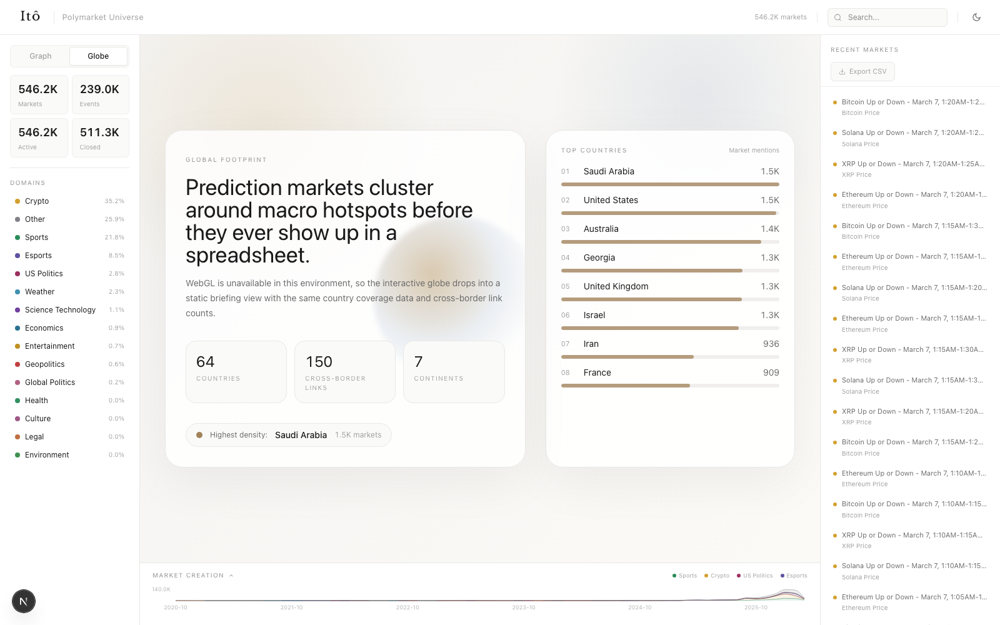
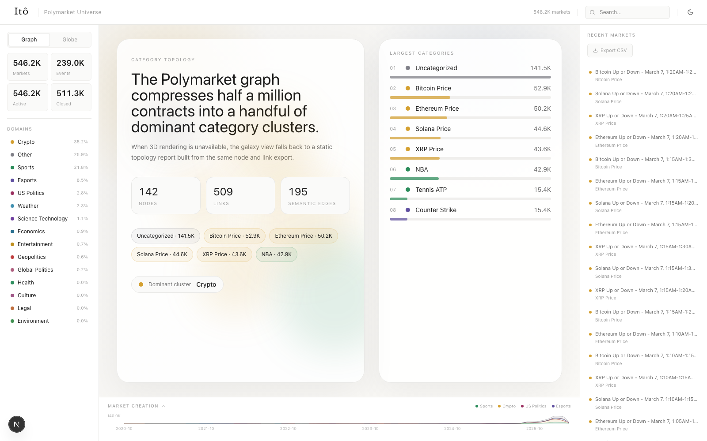
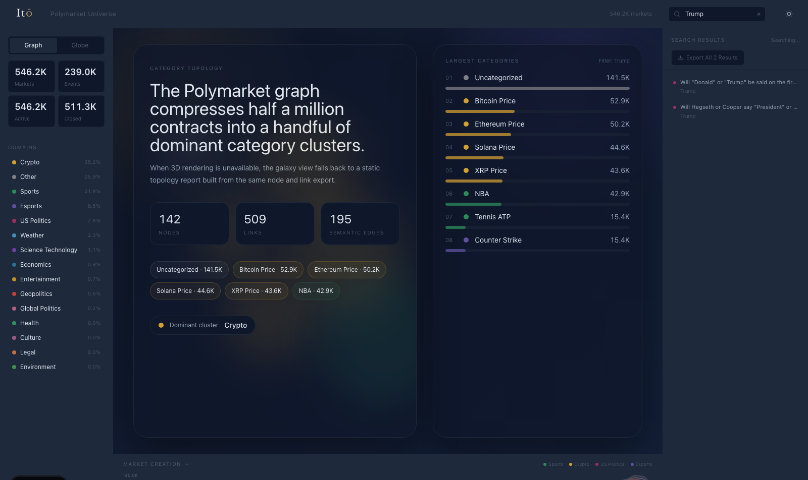
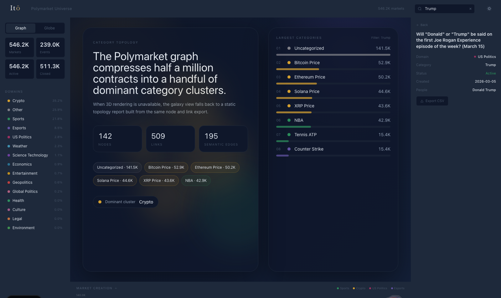

# polymarket-universe

Interactive graph database for the full Polymarket archive.

This repo turns 546,234 prediction markets into a research terminal with category topology, country coverage, monthly issuance history, full-text search, and CSV export.

**546,234 markets | 239,002 events | 142 category nodes | 509 links | 64 countries | 2020-10 to 2026-03**



---

## what it does

Polymarket is easy to browse one market at a time and hard to understand as a system. This app reframes the archive as a graph:

- **Globe view** maps country-linked markets and cross-border relationships.
- **Graph view** compresses the archive into major category clusters like crypto, sports, politics, weather, and macro.
- **Timeline view** shows market creation velocity by domain across 66 monthly snapshots.
- **Search + detail panels** let you query the full archive, inspect market metadata, and export slices to CSV.

The result is less like a consumer frontend and more like a market structure terminal.

## dashboard

Interactive overview with the global footprint view:


Category graph / topology view:



Dark-mode full-database search:



Market detail panel with structured metadata:



The app uses live 3D views when WebGL is available. In headless or restricted environments, it falls back to static briefing panels built from the same exported data so the UI remains readable instead of failing.

## quickstart

```bash
git clone https://github.com/Ito-Markets/polymarket-universe.git
cd polymarket-universe
npm install
npm run dev
```

Open `http://localhost:3000`.

No separate backend is required for local exploration. The search endpoint runs inside Next.js and the graph exports are already checked in.

## repo structure

```text
polymarket-universe/
  src/
    app/
      page.tsx              # main dashboard shell
      layout.tsx            # metadata + fonts
      api/search/route.ts   # title search across the full market index
    components/
      GlobeView.tsx         # globe / country coverage surface
      GalaxyGraph.tsx       # category topology surface
      Sidebar.tsx           # domain filters + top-level stats
      DetailPanel.tsx       # market search, node detail, CSV export
      TimelineChart.tsx     # monthly market creation history
      CountryModal.tsx      # country breakdown modal
    lib/
      store.ts              # zustand UI state
      utils.ts              # colors, formatters, CSV helpers, WebGL fallback check
  public/data/
    stats.json              # top-level counts
    graph_categories.json   # nodes + links for the category graph
    countries.json          # country coverage counts
    globe_arcs.json         # cross-border relationship arcs
    timeline.json           # monthly creation history
    top_markets.json        # recent market records for the detail panel
    country_details.json    # per-country domain + market samples
  data/
    all_markets_index.part*.json  # sharded full searchable market title index
  screenshots/
    *.png                   # GitHub README assets
```

## data surfaces

### archive scale

| metric | value |
|--------|-------|
| Total markets indexed | 546,234 |
| Event groups | 239,002 |
| Category nodes | 142 |
| Category links | 509 |
| Cross-border arcs | 150 |
| Countries with classified coverage | 64 |
| Timeline span | 2020-10 to 2026-03 |

### dominant clusters

| domain | markets |
|--------|---------|
| Crypto | 192,514 |
| Other / uncategorized | 141,491 |
| Sports | 118,826 |
| Esports | 46,642 |
| US Politics | 15,363 |
| Weather | 12,545 |

### top countries in the current export

| country | linked markets |
|---------|----------------|
| Saudi Arabia | 1,540 |
| United States | 1,519 |
| Australia | 1,412 |
| Georgia | 1,281 |
| United Kingdom | 1,275 |
| Israel | 1,254 |

## API and exports

| surface | returns |
|---------|---------|
| `GET /api/search?q=trump&limit=100` | full-database title search results |
| `GET /api/search?q=trump&export=1` | full result set for CSV export |
| `GET /data/stats.json` | top-line market, event, and status counts |
| `GET /data/graph_categories.json` | nodes and links for the topology view |
| `GET /data/countries.json` | country-level market counts |
| `GET /data/globe_arcs.json` | cross-border relationship arcs |
| `GET /data/timeline.json` | monthly stacked issuance history |
| `GET /data/top_markets.json` | recent market objects for the right-hand panel |

## stack

- Next.js 16 + React 19
- Zustand for dashboard state
- `react-force-graph-3d` for the category network
- `react-globe.gl` for the country view
- Recharts for the issuance timeline
- Static JSON exports for fast local startup

## limitations

- This repo ships a **read-only visualization layer**. The upstream ETL / Neo4j loading pipeline is not included here.
- Search is **title-based**, not semantic.
- Some exported status counts are internally inconsistent, so the most reliable top-line numbers are total markets, events, graph nodes/links, country coverage, and timeline span.
- WebGL is required for the full 3D experience. Environments without it fall back to static summary panels.

---

Built by [Itô Markets](https://github.com/Ito-Markets).
